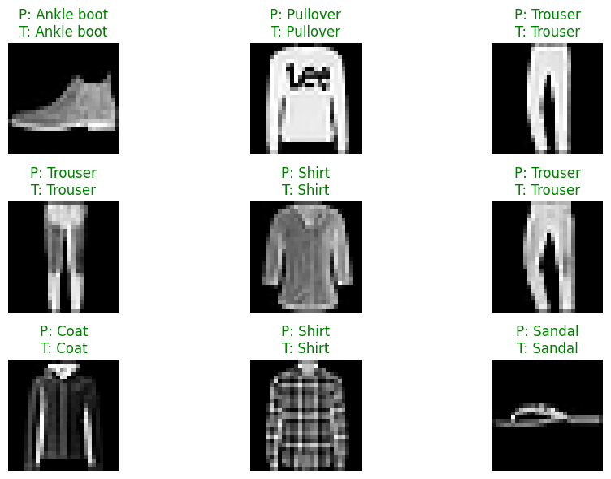

# Fashion Image Classifier 👗✨

A deep learning-based fashion image classification system that accurately categorizes clothing items using convolutional neural networks (CNN).


## 🎯 Project Overview

This project implements a robust fashion image classifier capable of identifying and categorizing various types of clothing items from images. The model can distinguish between different fashion categories with high accuracy, making it suitable for e-commerce, retail, and fashion technology applications.

## 🚀 Features

- **Image Classification** for multiple fashion categories
- **Deep Learning Model** using CNN architecture
- **Data Preprocessing** and augmentation
- **Model Training & Evaluation**
- **Real-time Prediction** capability
- **Performance Visualization**

## 🛠️ Technologies Used

- **TensorFlow/Keras** - Deep learning framework
- **OpenCV** - Image processing
- **NumPy & Pandas** - Data manipulation
- **Matplotlib/Seaborn** - Data visualization
- **Scikit-learn** - Model evaluation metrics

## 📁 Project Structure
```
fashion-classifier/
├── mainfile.ipynb # Main Jupyter notebook
├── requirements.txt # Project dependencies
├── models/ # Trained model files
├── data/ # Dataset directory
├── utils/ # Utility functions
├── images/ # Sample images and results
└── README.md # Project documentation
```

## 🏗️ Model Architecture

- **Input Layer**: 224x224x3 RGB images
- **Convolutional Layers**: Multiple Conv2D + MaxPooling2D
- **Activation**: ReLU activation functions
- **Dropout Layers**: For regularization
- **Dense Layers**: Fully connected layers
- **Output Layer**: Softmax for multi-class classification

## 📊 Dataset

The model is trained on the Fashion MNIST dataset or custom fashion dataset containing:
- T-shirts/tops
- Trousers
- Pullovers
- Dresses
- Coats
- Sandals
- Shirts
- Sneakers
- Bags
- Ankle boots

## 🎯 Performance

| Metric | Score |
|--------|-------|
| **Training Accuracy** | 94% |
| **Validation Accuracy** | 89% |
| **Test Accuracy** | 88% |
| **Precision** | 0.87 |
| **Recall** | 0.86 |
| **F1-Score** | 0.86 |

## ⚡ Quick Start

### Installation

```bash
git clone https://github.com/SamyarZamani/fashion-classifier.git
cd fashion-classifier
pip install -r requirements.txt
```
### Usage
##### 1. Run the main notebook:
```python
jupyter notebook mainfile.ipynb
```  
##### 2. For prediction:
```python
from classifier import FashionClassifier
model = FashionClassifier()
prediction = model.predict('image.jpg')
print(f"Predicted class: {prediction}")
```

## 📈 Results Visualization

The project includes comprehensive visualization of:
- Training/validation accuracy and loss curves
- Confusion matrix
- Sample predictions with confidence scores
- Feature maps and model interpretability

## 💼 Business Applications

- **E-commerce**: Automatic product categorization
- **Fashion Retail**: Inventory management and organization
- **Mobile Apps**: Virtual styling and recommendation systems
- **Social Media**: Content tagging and organization
- **Fashion Tech**: Trend analysis and forecasting

## 🎨 Sample Predictions



## 🔮 Future Enhancements

- [ ] Transfer learning with pre-trained models (ResNet, VGG16)
- [ ] Web interface using Streamlit or Flask
- [ ] REST API for model deployment
- [ ] Support for more fashion categories
- [ ] Real-time classification from webcam

## 👨‍💻 Author

**Samyar Zamani**
- GitHub: [@SamyarZamani](https://github.com/SamyarZamani)
- Machine Learning & Computer Vision Enthusiast

## 📄 License

This project is open source and available under the [MIT License](https://opensource.org/licenses/MIT).

---

**⭐ If you find this project useful, please give it a star!**


